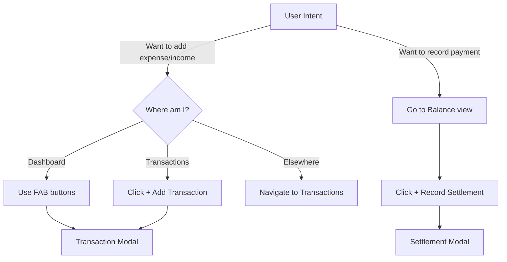

# Context-Specific Action Buttons

## Overview

Transform the global "Add New" button into context-specific actions per view, improving clarity and reducing cognitive load. This aligns with the philosophy that creation actions should live where their consequences are immediately visible.

## Architecture Decision: FABs Scope

**Current State:** FABs (Floating Action Buttons) are global - visible on all views.**Recommendation:** Make FABs Dashboard-only.**Rationale:**

- Dashboard is insight-focused and should remain calm
- FABs provide quick access without cluttering the layout
- Other views will have their own prominent, context-specific buttons
- Reduces visual noise in transactional views

## Changes to Implement

### 1. Remove "Add New" from Header

Location: [`src/components/ExpenseTracker.tsx`](src/components/ExpenseTracker.tsx) lines ~1731-1739**Remove this button entirely:**

```tsx
{/* Add New Button */}
<button
  onClick={() => setShowAddModal(true)}
  className="bg-purple-600 hover:bg-purple-700 px-4 py-2 rounded-lg flex items-center gap-2 transition-colors"
  title="Add Transaction (⌘N)"
>
  <PlusCircle className="w-4 h-4" />
  <span className="text-sm font-medium">Add New</span>
</button>
```

**Why:** Generic actions don't belong in a global header. The header should only contain actions that affect the whole app (Save, Settings, Help).

### 2. Add "+ Add Transaction" Button in Transactions View

Location: [`src/components/ExpenseTracker.tsx`](src/components/ExpenseTracker.tsx) - Inside the transactions view, before the search input**Add this button at the top of the Transactions view:**

```tsx
{/* Transactions view */}
{currentView === 'transactions' && (
  <div className="bg-slate-800/50 backdrop-blur border border-slate-700 rounded-2xl p-6">
    {/* Header with Add Button */}
    <div className="flex items-center justify-between mb-6">
      <h3 className="text-xl font-bold">My Transactions</h3>
      <button
        onClick={() => setShowAddModal(true)}
        className="bg-purple-600 hover:bg-purple-700 px-4 py-2 rounded-lg flex items-center gap-2 transition-colors"
        title="Add Transaction (⌘N)"
      >
        <PlusCircle className="w-4 h-4" />
        <span className="text-sm font-medium">Add Transaction</span>
      </button>
    </div>
    
    {/* Rest of transactions view... */}
```

**Key Design Points:**

- Prominent but not overwhelming
- Consistent styling with other primary actions
- Clear label: "Add Transaction" (not generic "Add New")
- Positioned where users expect it (top-right of the list)

### 3. Make FABs Dashboard-Only

Location: [`src/components/ExpenseTracker.tsx`](src/components/ExpenseTracker.tsx) lines ~3768-3793**Wrap FABs in conditional rendering:**

```tsx
{/* Floating Action Buttons - Dashboard Only (Phase 1 Feature #1 & #10) */}
{currentView === 'dashboard' && (
  <div className="fixed bottom-6 right-6 flex flex-col gap-3 z-30">
    {/* Quick Income Button */}
    <button
      onClick={() => openQuickAdd('income')}
      className="w-14 h-14 bg-green-600 hover:bg-green-700 rounded-full shadow-lg hover:shadow-xl flex items-center justify-center transition-all hover:scale-110 active:scale-95 animate-bounce-slow group"
      title="Quick Income (Shortcut: I)"
    >
      <TrendingUp className="w-6 h-6 text-white" />
      <span className="absolute right-full mr-3 bg-slate-900 text-white px-3 py-1.5 rounded-lg text-sm whitespace-nowrap opacity-0 group-hover:opacity-100 transition-opacity pointer-events-none shadow-lg">
        Quick Income (I)
      </span>
    </button>
    
    {/* Quick Expense Button */}
    <button
      onClick={() => openQuickAdd('expense')}
      className="w-14 h-14 bg-red-600 hover:bg-red-700 rounded-full shadow-lg hover:shadow-xl flex items-center justify-center transition-all hover:scale-110 active:scale-95 animate-bounce-slow group"
      title="Quick Expense (Shortcut: E)"
    >
      <TrendingDown className="w-6 h-6 text-white" />
      <span className="absolute right-full mr-3 bg-slate-900 text-white px-3 py-1.5 rounded-lg text-sm whitespace-nowrap opacity-0 group-hover:opacity-100 transition-opacity pointer-events-none shadow-lg">
        Quick Expense (E)
      </span>
    </button>
  </div>
)}
```

**Why Dashboard-Only:**

- Dashboard is insight/read-focused - FABs provide quick access without cluttering
- Transactions view has its own prominent "+ Add Transaction" button
- Balance view has "+ Record Settlement" button
- Reduces visual competition and keeps each view focused

### 4. Verify Balance View (No Changes Needed)

Location: [`src/components/ExpenseTracker.tsx`](src/components/ExpenseTracker.tsx) - Balance view**Already has the correct button:**

```tsx
<button
  onClick={() => setShowSettlementModal(true)}
  className="w-full sm:w-auto px-4 py-2 bg-purple-600 hover:bg-purple-700 rounded-lg transition-colors flex items-center justify-center gap-2 text-sm sm:text-base"
>
  <PlusCircle className="w-5 h-5" />
  Record Payment
</button>
```

✅ This is perfect - action matches mental model, no changes needed.

### 5. Categories View (No Changes Yet)

Location: [`src/components/ExpenseTracker.tsx`](src/components/ExpenseTracker.tsx) - Categories view**Decision:** No add button for now.**Rationale:**

- Categories are currently system-defined (Housing, Food, etc.)
- Adding a button that doesn't work or opens a half-baked modal is worse than omitting it
- Custom categories feature should be a separate, well-designed implementation
- Deferring this maintains quality over premature features

## View-by-View Summary

| View | Action Button | Rationale ||------|---------------|-----------|| **Header** | ❌ Remove "Add New" | Only global actions belong here || **Dashboard** | ✅ Keep FABs only | Quick access, non-intrusive, insight-focused || **Transactions** | ✅ Add "+ Add Transaction" | Primary creation point, clear intent || **Categories** | ⏸️ None (deferred) | Wait for custom categories feature || **Balance** | ✅ Already has "+ Record Settlement" | Perfect as-is |

## UX Flow Diagram




## Benefits

1. **Clarity** - No ambiguity about what you're adding
2. **Discoverability** - Actions are where users look for them
3. **Reduced Cognitive Load** - No mental mapping from generic to specific
4. **Professional** - Follows patterns from Gmail, Notion, Linear, banking apps
5. **Cleaner Header** - More breathing room, less clutter
6. **Scoped FABs** - Dashboard remains calm, other views stay focused

## Keyboard Shortcuts (No Changes)

- **⌘N / Ctrl+N** - Still opens transaction modal (works everywhere)
- **E** - Quick expense (Dashboard only now)
- **I** - Quick income (Dashboard only now)

## Testing Checklist

- [ ] Header shows only: Save, Help, Settings (no Add New)
- [ ] Dashboard shows FABs in bottom-right corner
- [ ] Transactions view shows "+ Add Transaction" button at top-right
- [ ] FABs are NOT visible in Transactions/Categories/Balance views
- [ ] Balance view still has "+ Record Settlement" button
- [ ] All buttons open correct modals
- [ ] Keyboard shortcuts still work (⌘N, E, I)
- [ ] Mobile: buttons wrap gracefully, touch targets are adequate
- [ ] Modal opens with correct pre-filled data based on context

## Future Enhancement: Custom Categories

**Deferred to separate plan.**When implemented, Categories view would get:

```tsx
<button className="...">
  <PlusCircle className="w-4 h-4" />
  <span>Add Category</span>
</button>
```

But only after:

- Category data model supports user-defined categories
- Storage includes custom categories in vault exports
- Proper validation and duplicate prevention
- Transaction reassignment flow for deleted categories

## Files to Modify

- [`src/components/ExpenseTracker.tsx`](src/components/ExpenseTracker.tsx)
- Remove "Add New" from header
- Add conditional wrapper around FABs
- Add "+ Add Transaction" button in Transactions view

## Design Philosophy

This change embodies:

- **Actions live where consequences are visible**