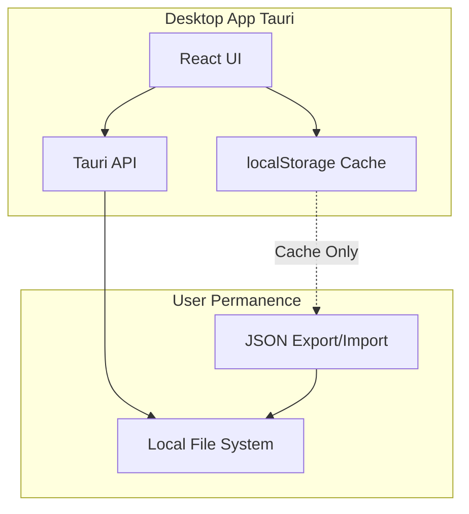

# Tauri Desktop App Setup

## Architecture Overview




## Implementation Plan

### Phase 1: Tauri Setup & Configuration

**1.1 Install Tauri Dependencies**

- Add `@tauri-apps/cli` and `@tauri-apps/api` to [`package.json`](package.json)
- Install Rust toolchain (prerequisite for Tauri)
- Initialize Tauri project structure

**1.2 Configure Tauri**

- Create `src-tauri/tauri.conf.json` with macOS-specific settings
- Configure window size (1200x800), title, resizable
- Set app identifier: `com.expensetracker.app`
- Disable unnecessary permissions (keep only file dialog for export/import)
- Configure app icon for macOS

**1.3 Update Build Scripts**

- Add `tauri:dev` script for development
- Add `tauri:build` script for production builds
- Ensure Vite config works with Tauri

### Phase 2: Storage System Adaptation

**2.1 Keep Current localStorage Implementation**

- No changes needed to [`src/lib/localStorageAdapter.ts`](src/lib/localStorageAdapter.ts)
- localStorage remains runtime cache (survives between app launches)
- JSON export/import remains the permanence mechanism

**2.2 Enhance Export/Import with Native Dialogs**

- Replace browser download for export with Tauri's `save` dialog
- Replace browser file input for import with Tauri's `open` dialog
- Update [`src/components/ExpenseTracker.tsx`](src/components/ExpenseTracker.tsx) export/import handlers
- Maintain JSON format compatibility

Example for export:

```typescript
import { save } from '@tauri-apps/api/dialog';
import { writeTextFile } from '@tauri-apps/api/fs';

const filePath = await save({
  defaultPath: `expenses-${dateString}.json`,
  filters: [{ name: 'JSON', extensions: ['json'] }]
});

if (filePath) {
  await writeTextFile(filePath, jsonData);
}
```


### Phase 3: Version Management

**3.1 Create Version Configuration**

- Create [`src/config/version.ts`](src/config/version.ts) with `APP_VERSION`, `RELEASE_DATE`, `CHANGELOG`
- Version format: semantic versioning (1.0.0)
- Sync with `package.json` version

**3.2 Add About/Settings Screen**

- Create [`src/components/AboutScreen.tsx`](src/components/AboutScreen.tsx) component
- Display app name, version, release date
- Add "Check for Updates" button (opens GitHub releases page in browser)
- Show data permanence info (explain localStorage vs JSON export)
- Add to navigation in [`src/components/ExpenseTracker.tsx`](src/components/ExpenseTracker.tsx)

**3.3 Optional: Pre-Update Export Reminder**

- Add check on app startup for version changes
- If new version detected, show modal recommending data export
- Store last-seen version in localStorage
- Simple non-blocking reminder

### Phase 4: macOS Build & Distribution

**4.1 Configure macOS Bundle**

- Set up `src-tauri/tauri.conf.json` for `.dmg` and `.app` outputs
- Configure app icon (512x512 PNG → ICNS)
- Set macOS category: `public.app-category.finance`
- Configure code signing (optional for personal use, required for distribution)

**4.2 Create Build Documentation**

- Create [`BUILDING.md`](BUILDING.md) with step-by-step build instructions
- Document prerequisites (Rust, Xcode Command Line Tools)
- Add troubleshooting section

**4.3 Release Process Documentation**

- Create [`RELEASE.md`](RELEASE.md) with manual release workflow:

1. Update version in `package.json` and `src/config/version.ts`
2. Update changelog
3. Run tests and linting
4. Build: `npm run tauri:build`
5. Create GitHub release with `.dmg` file
6. Tag release in git

### Phase 5: Testing & Polish

**5.1 Desktop-Specific Testing**

- Test export to native file system
- Test import from native file system
- Verify localStorage persistence between app restarts
- Test window resize, minimize, maximize
- Verify app icon displays correctly in Dock

**5.2 Update Existing Tests**

- Ensure Vitest tests still pass (no changes needed)
- Tests run independently of Tauri (continue testing React components)

**5.3 Optional: Add macOS Menu Bar**

- Add native menu bar with File > Export, File > Import, Help > About
- Standard macOS keyboard shortcuts

## File Changes Summary

**New Files:**

- `src-tauri/tauri.conf.json` - Tauri configuration
- `src-tauri/src/main.rs` - Rust backend entry point (auto-generated)
- `src-tauri/Cargo.toml` - Rust dependencies (auto-generated)
- `src-tauri/icons/` - App icons for macOS
- `src/config/version.ts` - Version info
- `src/components/AboutScreen.tsx` - About/Settings screen
- `BUILDING.md` - Build instructions
- `RELEASE.md` - Release workflow

**Modified Files:**

- [`package.json`](package.json) - Add Tauri deps and scripts
- [`src/components/ExpenseTracker.tsx`](src/components/ExpenseTracker.tsx) - Update export/import to use Tauri dialogs, add About screen to navigation
- `src/vite-env.d.ts` - Add Tauri API types

**No Changes:**

- [`src/lib/localStorageAdapter.ts`](src/lib/localStorageAdapter.ts) - Keep as-is
- [`src/lib/storage.ts`](src/lib/storage.ts) - Keep as-is
- All calculation/formatting utilities - No changes
- All tests - No changes

## Success Criteria

- ✓ App launches as native macOS application
- ✓ localStorage works between app restarts (cache)
- ✓ Export saves JSON to native file system
- ✓ Import loads JSON from native file system
- ✓ Version info visible in About screen
- ✓ `.dmg` installer can be created with `npm run tauri:build`
- ✓ All existing tests pass
- ✓ No linting errors

## Future Enhancements (Not in This Plan)

- Windows/Linux builds
- Auto-update system with server